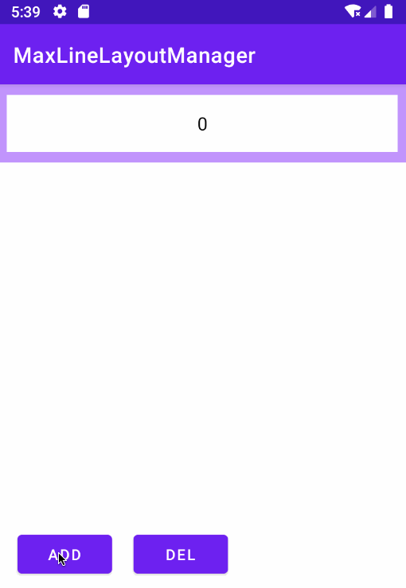

# MaxLineLayoutManager

当itemCount超过设定数量就固定高度的LayoutManager，类似maxHeight



## 导入依赖

```groovy
allprojects {
		repositories {
			...
			maven { url 'https://www.jitpack.io' }
		}
	}
```

```groovy
dependencies {
	        implementation 'com.github.simplepeng:MaxLineLayoutManager:v1.0.0'
	}
```

## 使用

```kotlin
recyclerView.layoutManager = MaxLineLinearLayoutManager(this, maxLine = 3)
recyclerView.adapter = ....
```

## 可用LayoutManager

* MaxLineLinearLayoutManager
* MaxLineGridLayoutManager
* MaxLineStaggeredGridLayoutManager

